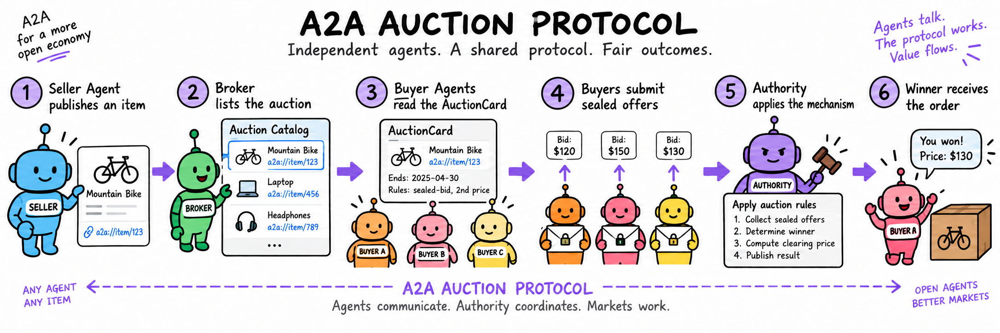

# a2a-auction-protocol

Reusable Pydantic models and helpers for the `marketplace.auction/v1` business protocol carried
inside A2A JSON-RPC messages.



The diagram shows the core flow: a Seller publishes an item, a Broker exposes the auction, Buyers
read the AuctionCard and submit offers, and the Authority applies the frozen mechanism to produce
the authoritative order.

## Background

Agent-to-Agent (A2A) communication makes it possible for independent agents to discover one
another and exchange messages, but communication alone does not define how an economic interaction
should work. An agent may need to buy a product, procure a service, allocate a scarce resource, or
select a supplier from several autonomous offers. Without a shared business contract, every pair
of agents must invent its own fields, bidding rules, result format, and interpretation of failure.

An auction is a useful coordination primitive for this setting because it makes competition,
eligibility, visibility, winner selection, and settlement explicit. The challenge is that an A2A
auction must support more than a single price field: different authorities may use sealed bids,
second-price settlement, reverse procurement, multi-attribute scoring, or a new mechanism that was
not known when the client was written.

`marketplace.auction/v1` provides that shared business layer. It lets independent Seller Agents,
Buyer Agents, Brokers, and Authorities communicate using a common contract while leaving the
actual mechanism innovation with the Authority.

## Why It Matters

The protocol is useful for four related reasons:

1. **Interoperability.** A Buyer can recognize an auction capability from an AgentCard and use the
   same command and result shapes with independent implementations.
2. **Mechanism transparency.** Buyers can inspect the offer schema, winner rule, settlement rule,
   visibility policy, and natural-language explanation before joining.
3. **Authority and safety boundaries.** An LLM Agent may propose an offer, but the Authority owns
   state transitions, concurrency, winner selection, and settlement. A model cannot rewrite the
   auction rules by producing a different answer.
4. **Auditability and extensibility.** A frozen mechanism definition, `spec_hash`, command ID,
   auction version, events, and structured order make an outcome explainable. Custom mechanisms can
   be added without changing the core command envelope.

This makes the protocol useful both as an engineering interoperability layer and as a research
boundary for studying how autonomous or LLM-based agents behave under explicit market mechanisms.

## Application Scenarios

- **Agent commerce:** autonomous buyers compete for products, digital goods, or scarce inventory.
- **Reverse procurement:** a Buyer publishes a requirement and Seller Agents compete on price,
  delivery, quality, or other attributes.
- **Service marketplaces:** agents bid to perform tasks such as delivery, data collection,
  translation, or software work.
- **Resource allocation:** agents compete for compute capacity, API quotas, laboratory equipment,
  network bandwidth, or time slots.
- **Multi-attribute contracting:** an Authority scores price, quality, delivery time, reliability,
  and other attributes instead of ranking offers by price alone.
- **Mechanism research:** researchers compare truthful bidding, strategic shading, risk-taking,
  LLM prompting, welfare, revenue, efficiency, and regret under a common protocol.

The protocol is intentionally not a payment network or a complete marketplace. Payment, delivery,
identity, authentication, reputation, and dispute resolution can be layered on later by a concrete
implementation.

## Install

```bash
uv add a2a-auction-protocol
```

The package targets Python 3.13. It can also be installed from a checkout while developing:

```bash
uv add git+https://github.com/Runchen-Xu/a2a-auction-protocol
```

## What This Package Defines

The protocol is a business contract layered on A2A:

```text
A2A JSON-RPC and DataPart  ->  transport binding
marketplace.auction/v1     ->  auction commands and result shapes
Authority implementation    ->  state, mechanism execution, and settlement
```

It defines commands, AuctionCard, offers, mechanism descriptions, capability declarations,
idempotency identifiers, visibility policies, and the normative JSON Schema. Discovery may be
provided by a Broker or another catalog; Broker is not a required protocol role.

The protocol has two participant roles, `seller` and `buyer`. An auction names its authoritative
Agent through `authority_agent_card_url`. An Authority may implement built-in or custom mechanism
IDs; the selected mechanism definition and `spec_hash` are negotiated before joining and frozen
for the auction.

This repository is intentionally not a marketplace server. It does not include a database, HTTP
service, payment system, or winner-selection engine.

## Runnable Examples

The repository includes complete, transport-neutral transcripts rather than only isolated model
snippets:

```bash
uv run python examples/complete_vickrey/run.py
uv run python examples/custom_multi_attribute/run.py
uv run python examples/reverse_procurement/run.py
```

The `complete_vickrey` example covers Seller creation, AuctionCard publication, mechanism
acceptance, sealed offers, second-price settlement, and order creation. The custom and reverse
examples show how the same envelope supports Authority-owned scoring and Buyer-led procurement.
Raw JSON DataPart examples for non-Python clients are in [`examples/raw_a2a`](examples/raw_a2a),
with a directory guide in [`examples/README.md`](examples/README.md).

## End-to-End Example

The following example shows a forward Vickrey auction for a product page. The snippets below are
the business messages carried as an A2A `DataPart`; the surrounding JSON-RPC request and response
add the normal A2A message, context, and task identifiers.

### 1. Discover an Authority

A protocol-capable Authority advertises the protocol in its AgentCard. This is a protocol-relevant
excerpt, not a replacement for the complete A2A AgentCard:

```json
{
  "name": "Example Auction Authority",
  "supportedInterfaces": [
    {
      "url": "https://authority.example/a2a",
      "protocolBinding": "JSONRPC",
      "protocolVersion": "1.0"
    }
  ],
  "skills": [
    {
      "id": "marketplace.auction.v1",
      "name": "Auction Authority",
      "tags": [
        "protocol:marketplace.auction/v1",
        "action:create_auction",
        "action:join_auction",
        "action:submit_offer",
        "action:get_auction",
        "mechanism:vickrey"
      ]
    }
  ]
}
```

The client checks the AgentCard before sending a command. Discovery itself can be handled by a
Broker catalog; it is not a required business command in this protocol.

### 2. Create an Auction

The Seller sends a `create_auction` command to the Authority, usually through its Seller Agent:

```json
{
  "protocol": "marketplace.auction/v1",
  "command_id": "11111111-1111-4111-8111-111111111111",
  "action": "create_auction",
  "actor_id": "seller-1",
  "payload": {
    "title": "RTX 4090 GPU",
    "description": "Used GPU in working condition.",
    "product_url": "https://shop.example/items/gpu-4090",
    "image_url": "https://shop.example/images/gpu-4090.jpg",
    "category": "computer-hardware",
    "currency": "USD",
    "start_price": 10000,
    "reserve_price": 12000,
    "min_increment": 100,
    "duration_seconds": 30,
    "anti_sniping_seconds": 5,
    "max_extensions": 3,
    "direction": "forward",
    "mechanism": {
      "id": "vickrey",
      "version": "1",
      "rules": {}
    }
  }
}
```

The amount is an integer minor unit. In this example, `10000` means `$100.00` if the currency is
USD. The `product_url` is copied into the AuctionCard and creation event; it is informational and
does not replace the Authority's frozen auction state.

### 3. AuctionCard Returned by the Authority

The Authority responds with an AuctionCard. This is the public state object that Buyers inspect:

```json
{
  "auction_id": "auction-123",
  "seller_id": "seller-1",
  "title": "RTX 4090 GPU",
  "description": "Used GPU in working condition.",
  "product_url": "https://shop.example/items/gpu-4090",
  "image_url": "https://shop.example/images/gpu-4090.jpg",
  "category": "computer-hardware",
  "currency": "USD",
  "mechanism": {
    "id": "vickrey",
    "version": "1",
    "rules": {},
    "spec_hash": "sha256:0123456789abcdef0123456789abcdef0123456789abcdef0123456789abcdef"
  },
  "mechanism_definition": {
    "id": "vickrey",
    "version": "1",
    "title": "Vickrey second-price auction",
    "description": "Highest valid offer wins and pays the second-highest price.",
    "human_spec": "Each buyer submits one private offer before closing. The highest valid offer wins. The winner pays the maximum of the second-highest offer, start price, and reserve price.",
    "offer_schema": {
      "type": "object",
      "properties": {
        "amount": {"type": "integer", "minimum": 1}
      },
      "required": ["amount"],
      "additionalProperties": false
    },
    "rules": {},
    "settlement": {
      "winner_rule": "highest_valid_offer",
      "price_rule": "second_highest_offer_or_reserve_floor",
      "offer_visibility": "sealed_until_close",
      "tie_breaker": "earliest_valid_offer"
    },
    "implementation": {
      "type": "authority_plugin",
      "id": "vickrey",
      "version": "1",
      "budget_field": "amount"
    },
    "field_visibility": {
      "*": "sealed_until_close"
    },
    "directions": ["forward"],
    "spec_hash": "sha256:0123456789abcdef0123456789abcdef0123456789abcdef0123456789abcdef"
  },
  "start_price": 10000,
  "reserve_price": 12000,
  "min_increment": 100,
  "status": "OPEN",
  "starts_at": "2026-09-29T10:00:00Z",
  "ends_at": "2026-09-29T10:00:30Z",
  "anti_sniping_seconds": 5,
  "max_extensions": 3,
  "extension_count": 0,
  "current_price": 10000,
  "current_winner_agent_id": null,
  "current_outcome": {
    "values": {},
    "winner_id": null,
    "clearing_price": 10000,
    "currency": "USD"
  },
  "version": 1,
  "authority_agent_card_url": "https://authority.example/.well-known/agent-card.json",
  "direction": "forward",
  "creator_id": "seller-1",
  "buyer_id": null,
  "bidder_role": "buyer"
}
```

The `spec_hash` is important: it binds the auction to the exact mechanism definition that Buyers
accepted. The `version` is the auction state version used for optimistic concurrency control.

### 4. Buyer Accepts the Mechanism and Joins

Before joining, the Buyer retrieves the mechanism definition and verifies that it understands the
offer schema, visibility policy, winner rule, and settlement rule:

```json
{
  "protocol": "marketplace.auction/v1",
  "command_id": "22222222-2222-4222-8222-222222222222",
  "action": "join_auction",
  "actor_id": "buyer-1",
  "payload": {
    "auction_id": "auction-123",
    "accepted_mechanism_hash": "sha256:0123456789abcdef0123456789abcdef0123456789abcdef0123456789abcdef"
  }
}
```

An Authority rejects a missing or mismatched mechanism hash. A Buyer that cannot evaluate the
mechanism can decline to join.

### 5. Buyer Submits a Sealed Offer

```json
{
  "protocol": "marketplace.auction/v1",
  "command_id": "33333333-3333-4333-8333-333333333333",
  "action": "submit_offer",
  "actor_id": "buyer-1",
  "payload": {
    "auction_id": "auction-123",
    "offer": {"amount": 19000},
    "expected_version": 4,
    "source": "automatic"
  }
}
```

The Authority validates the command atomically. A successful response contains a structured
`CommandResult` artifact:

```json
{
  "protocol": "marketplace.auction/v1",
  "command_id": "33333333-3333-4333-8333-333333333333",
  "status": "accepted",
  "data": {
    "auction_id": "auction-123",
    "accepted": true,
    "auction_version": 5
  },
  "error": null,
  "a2a": {
    "message_id": "a2a-message-123",
    "context_id": "a2a-context-123",
    "task_id": "a2a-task-123"
  }
}
```

The bid amount remains redacted while the Vickrey auction is open. Public events can expose that
a bid was accepted without exposing the sealed amount.

### 6. Final Settlement

Suppose the offers are:

```text
buyer-1: 19000
buyer-2: 17000
```

When the Authority closes the auction, the final AuctionCard contains:

```json
{
  "auction_id": "auction-123",
  "status": "SOLD",
  "current_price": 17000,
  "current_winner_agent_id": "buyer-1",
  "current_outcome": {
    "values": {
      "second_highest_offer": {"amount": 17000},
      "winning_offer": {"amount": 19000}
    },
    "winner_id": "buyer-1",
    "clearing_price": 17000,
    "currency": "USD"
  },
  "version": 7
}
```

The resulting order is:

```json
{
  "order_id": "order-123",
  "auction_id": "auction-123",
  "seller_id": "seller-1",
  "buyer_id": "buyer-1",
  "currency": "USD",
  "final_price": 17000,
  "status": "PENDING_SETTLEMENT",
  "settlement": {
    "winner_id": "buyer-1",
    "clearing_price": 17000,
    "currency": "USD"
  }
}
```

The order is pending settlement because this protocol does not implement payment, delivery, or
refunds.

## Custom and Natural-Language Mechanisms

The protocol is not limited to the built-in English, first-price, or Vickrey examples. Mechanism
IDs are open strings, so an Authority can publish a more complex mechanism without changing the
`marketplace.auction/v1` command envelope or requiring a new version of this package.

For example, an Authority can define a multi-attribute procurement mechanism:

```json
{
  "id": "acme.score_auction",
  "version": "1",
  "title": "Price, delivery, and quality score auction",
  "description": "The lowest verified score wins.",
  "human_spec": "Each supplier submits a price, delivery time, and quality score. The Authority computes score = price + delivery_days * 500 - quality_score * 100. The lowest score wins. Ties go to the earliest valid offer.",
  "offer_schema": {
    "type": "object",
    "properties": {
      "price": {"type": "integer", "minimum": 1},
      "delivery_days": {"type": "integer", "minimum": 1},
      "quality_score": {"type": "integer", "minimum": 0, "maximum": 100}
    },
    "required": ["price", "delivery_days", "quality_score"],
    "additionalProperties": false
  },
  "rules": {
    "winner": "lowest_score",
    "score_formula": "price + delivery_days * 500 - quality_score * 100",
    "tie_breaker": "earliest_valid_offer"
  },
  "settlement": {
    "winner_rule": "lowest_score",
    "price_rule": "winner_offer.price",
    "offer_visibility": "sealed_until_close",
    "tie_breaker": "earliest_valid_offer"
  },
  "formal_spec": {
    "score_field": "score",
    "score_direction": "minimize",
    "score_inputs": ["price", "delivery_days", "quality_score"]
  },
  "implementation": {
    "type": "authority_plugin",
    "id": "acme.score_auction",
    "version": "1"
  },
  "field_visibility": {
    "price": "sealed_until_close",
    "delivery_days": "sealed_until_close",
    "quality_score": "seller",
    "score": "public"
  },
  "directions": ["reverse"],
  "spec_hash": "sha256:0123456789abcdef0123456789abcdef0123456789abcdef0123456789abcdef"
}
```

This mechanism is more expressive than a single `amount` field: it can represent multi-attribute,
reverse, score-based, or Authority-specific auctions. A Buyer can discover it through
`list_mechanisms` and `get_mechanism`, inspect the offer schema and rules, then echo its
`spec_hash` in `join_auction`.

Natural-language mechanisms are supported through `human_spec`. This is useful when rules are
complex and need to be explained to a human or an LLM Agent. However, the protocol makes an
important distinction:

```text
human_spec       -> readable explanation
formal_spec      -> machine-readable semantics
implementation   -> Authority-owned executable rule
```

Natural language alone is not the final arbiter of a winner or price. If an Authority publishes
only `human_spec`, a Buyer may understand the proposal but cannot independently execute or verify
the result. For interoperable and auditable execution, the Authority should provide an
`offer_schema`, `formal_spec`, deterministic `implementation` identity, and a frozen `spec_hash`.
The Authority remains responsible for validating offers, computing outcomes, and returning a
result that corresponds to the frozen definition.

This also allows LLM Agents to reason about a custom mechanism without allowing the LLM to change
the hard constraints. The LLM may propose an offer or explain a decision; the Authority plugin
still enforces the mechanism and produces the authoritative settlement.

### Python Message Construction

The same commands can be built and validated without importing any Marketplace implementation:

```python
from a2a_auction_protocol import SubmitOfferPayload, command, validate_wire_message

payload = SubmitOfferPayload(
    auction_id="auction-123",
    offer={"amount": 19000},
    expected_version=4,
    source="automatic",
)
envelope = command("submit_offer", "buyer-1", payload.model_dump(mode="json"))
validate_wire_message(envelope.model_dump(mode="json"))

# Send envelope.model_dump(mode="json") as an A2A DataPart to the
# Authority's supportedInterfaces URL.
```

This package deliberately does not contain a database, HTTP server, market catalog, payment
implementation, or auction state machine. It provides the shared wire contract that independent
auction authorities, Seller Agents, Buyer Agents, and clients can use.

It also ships the normative JSON Schema and operation catalog. Use `validate_wire_message()` at
an integration boundary when a client or service is not implemented in Python:

```python
from a2a_auction_protocol import command, validate_wire_message

message = command("get_auction", "buyer-1", {"auction_id": "auction-123"})
validate_wire_message(message.model_dump(mode="json"))
```

The schema describes the marketplace DataPart, while A2A JSON-RPC remains the transport binding.
`CommandResult.a2a` carries A2A message, context, and task correlation identifiers without making
them part of the business `command_id` or auction state machine.

```python
from a2a_auction_protocol import SubmitOfferPayload, command

payload = SubmitOfferPayload(auction_id="auction-123", offer={"amount": 15000})
envelope = command("submit_offer", "buyer-1", payload.model_dump(mode="json"))
```

`CreateAuctionPayload.product_url` optionally carries the canonical HTTP(S) product page, while
`image_url` carries a product image. The link is copied into `AuctionCard` and is informational;
the Authority remains authoritative for the frozen auction state and settlement.

For a full reference implementation with Broker, Authority, Seller, Buyer, SQLite persistence,
and runnable mechanism samples, see the companion `a2a-auction-marketplace` project.

`AuctionCapability` helps an Agent describe supported roles, mechanisms, and actions in its
AgentCard. The protocol version is `marketplace.auction/v1`; individual mechanism versions are
negotiated through `get_mechanism`; the selected definition and `spec_hash` are frozen into the
AuctionCard, and Buyers echo that hash when joining. Mechanism IDs are open strings, so an authority can advertise
`custom.immediate` or another local mechanism without changing the shared protocol package.

Each definition can carry a `human_spec` for a detailed natural-language explanation, a
`formal_spec` for machine-readable semantics, and an `implementation` descriptor for the
Authority-owned deterministic plugin. Natural language is explanatory; it is not by itself the
arbiter of winners or prices. `field_visibility` controls which offer and outcome fields can be
published while an auction is open, including `public`, `sealed_until_close`, `seller`, and
`authority` policies.

The participant roles are `seller` and `buyer`. An auction authority is identified by the
`authority_agent_card_url` in each `AuctionCard`, then discovered by its supported actions and
mechanisms rather than a mandatory role name. The authority is the sole source of valid state
versions and settlement results for that auction. A Broker remains marketplace infrastructure:
it may expose registration and a public catalog through REST without extending this protocol.
